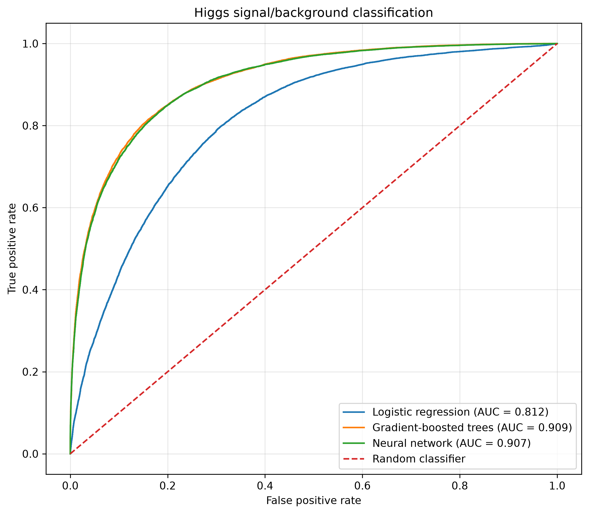
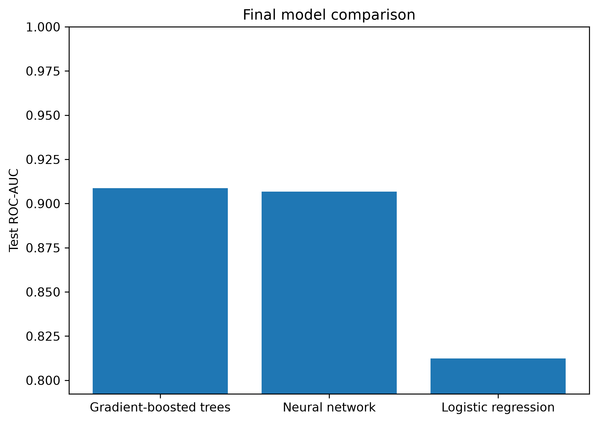
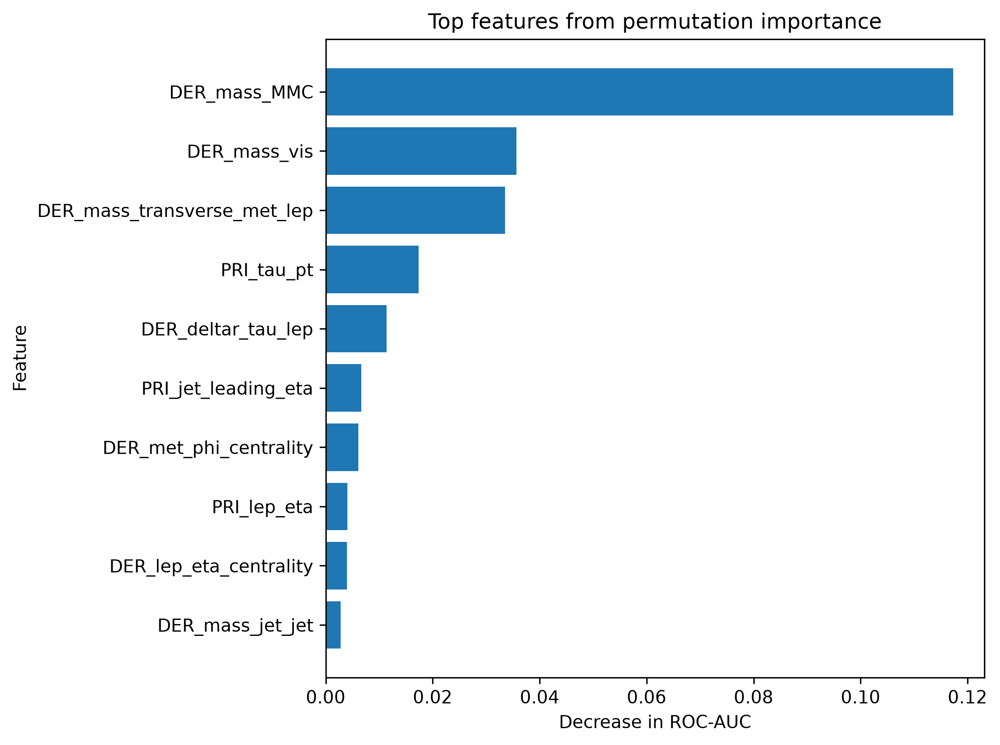
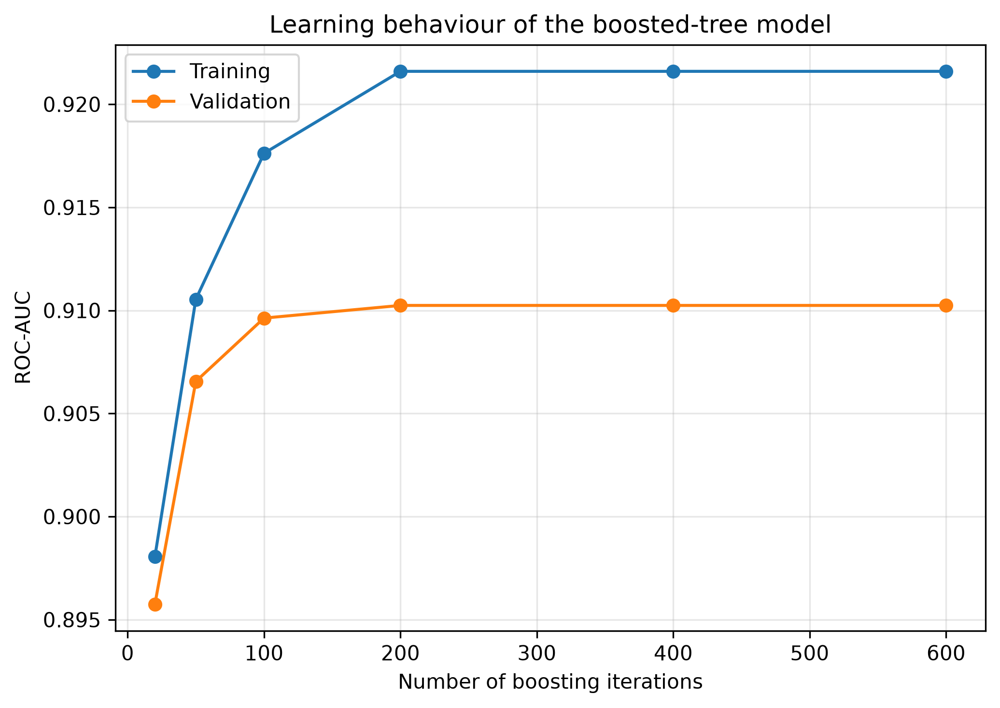

# Machine Learning for Higgs Boson Event Classification


## Overview

This project explores supervised machine learning for the classification of
simulated particle-physics events into Higgs-boson signal and background.

The project was developed as an introduction to machine-learning methods,
with an emphasis on understanding the complete workflow:

```text
physics data
    ↓
data exploration
    ↓
preprocessing
    ↓
model training
    ↓
validation
    ↓
final evaluation
    ↓
model interpretation
```

Three approaches are compared:

1. Logistic regression
2. Gradient-boosted decision trees
3. A fully connected neural network

The models are evaluated using ROC curves and ROC-AUC.

## Physics motivation

Particle-physics analyses often require separating rare signal processes from
large backgrounds, making binary classification a natural application of
machine learning.

The HIGGS benchmark provides simulated collision events with a set of
kinematic observables designed to distinguish signal from background.

A central question explored in this project is:

> How much additional discrimination can more flexible machine-learning models
> obtain compared with a simple linear classifier?

## Dataset

The project uses the 250,000-event training sample associated with the
Higgs Boson Machine Learning Challenge.

The dataset contains 30 input features together with an event identifier,
event weight, and signal/background label.

The dataset itself is not stored in this repository.

See [`data/README.md`](data/README.md) for information on obtaining the data.

## Models

### Logistic regression

Logistic regression provides a simple linear baseline. It predicts the
probability of an event being signal-like from a linear combination of the
input features.

### Gradient-boosted decision trees

A histogram-based gradient-boosted decision-tree classifier is used to
capture nonlinear relationships and interactions between observables.

### Neural network

A small fully connected neural network is implemented using PyTorch.

The network contains two hidden layers:

```text
30 input features
       ↓
64 neurons
       ↓
ReLU
       ↓
32 neurons
       ↓
ReLU
       ↓
1 output
```

The network is trained using binary cross-entropy with logits and the Adam
optimizer, with validation monitoring and early stopping.

## Preprocessing

The HIGGS dataset contains `-999` sentinel values for unavailable
measurements. These are treated as missing values.

For the neural-network and logistic-regression models:

1. missing values are imputed using the median of the training data;
2. features are standardized using the training data.

Preprocessing parameters are learned only from the development/training
sample and then applied to validation and test samples.

`EventId` is excluded because it is an event identifier.

The provided event `Weight` is retained as dataset information but is not used
as an input feature in this introductory classification study.

## Train/validation/test strategy

The full dataset is divided into a development sample and an independent
test sample:

```text
250,000 events
      |
      +------------------+
      |                  |
Development             Test
    80%                  20%
      |
      +----------+
      |          |
   Training   Validation
```

The development sample is used for model training, validation, feature
selection, and model selection.

The final test sample is kept separate and is used only for the final
evaluation.

## Results

The final comparison uses ROC-AUC evaluated on the independent test sample.

| Model                  | Test ROC-AUC |
| ---------------------- | -----------: |
| Gradient-boosted trees | **0.908759** |
| Neural network         | **0.906811** |
| Logistic regression    | **0.812336** |

The gradient-boosted tree achieves the best test ROC-AUC, with the neural
network performing very similarly. Both nonlinear approaches substantially
outperform the logistic-regression baseline.

### ROC curves



### Model comparison



## Feature importance

Permutation importance is used to investigate which observables have the
largest impact on the performance of the boosted-tree classifier.

This provides an exploratory view of which physics variables contain useful
information for signal/background discrimination.

Feature importance should not be interpreted as a direct statement of
physical causality, particularly when input variables are correlated.



## Overfitting and validation

The project explicitly separates model development from final testing.

The boosted-tree study illustrates the difference between training and
validation performance as model complexity increases.



The neural-network training also monitors validation performance and uses
early stopping to retain the best validation checkpoint.

## Lessons learned

This project provided practical experience with:

* supervised binary classification;
* training, validation, and test splits;
* preprocessing and missing-value handling;
* logistic regression;
* gradient-boosted decision trees;
* neural-network training with PyTorch;
* ROC curves and ROC-AUC;
* overfitting and model complexity;
* feature-importance analysis;
* reproducible Python environments;
* Git and GitHub workflows.

## Repository structure

```text
higgs_ml/
├── data/
│   └── README.md
├── figures/
│   ├── boosting_validation.png
│   ├── feature_importance.png
│   ├── final_model_comparison.png
│   └── final_roc_comparison.png
├── notebooks/
│   ├── 01_exploration.ipynb
│   ├── 02_neural_network.ipynb
│   └── 03_final_evaluation.ipynb
├── src/
├── .gitignore
├── README.md
└── requirements.txt
```

## Reproducing the analysis

Clone the repository:

```bash
git clone https://github.com/nicobenincasa/higgs_ml.git
cd higgs_ml
```

Create a virtual environment:

```bash
python3 -m venv .venv
source .venv/bin/activate
```

Install the dependencies:

```bash
python -m pip install -r requirements.txt
```

Place the HIGGS `training.csv` file at:

```text
data/training.csv
```

The notebooks can then be run using the `.venv` Python environment.

## Notebooks

### `01_exploration.ipynb`

Exploration of the dataset, physics observables, missing values,
signal/background separation, feature importance, and model complexity.

### `02_neural_network.ipynb`

Implementation and training of a small fully connected neural network using
PyTorch, including validation monitoring and early stopping.

### `03_final_evaluation.ipynb`

Self-contained final evaluation of all three models using an independent test
sample.

## Future directions

Possible extensions include:

* incorporating event weights into training and/or evaluation;
* systematic hyperparameter optimization;
* studying engineered versus lower-level observables;
* investigating classifier calibration.

## Author

**Nico Benincasa**

Particle-physics phenomenologist interested in dark matter, cosmological
phase transitions, gravitational waves, and computational methods.
